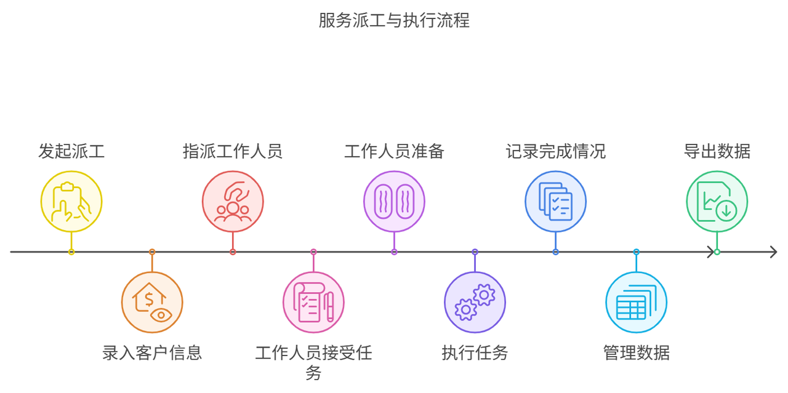

# Work Order Management System - WeChat Mini Program

A comprehensive work order management system designed for engineering equipment maintenance and repair services, built as a WeChat Mini Program.

## 📋 Table of Contents

- [Background](#background)
- [Features](#features)
- [Project Structure](#project-structure)
- [Technology Stack](#technology-stack)
- [Installation](#installation)
- [Usage](#usage)
- [Version History](#version-history)
- [Future Development](#future-development)
- [Business Model](#business-model)
- [License](#license)

## 🎯 Background



### Business Challenges

As companies expand their operations and upgrade services, traditional maintenance workflows face significant limitations:

#### 1. Inconvenient Customer Reporting
- **Communication gaps**: Phone-based reporting makes it difficult for customers to accurately describe issues, and staff may miss critical information during recording.
- **Poor traceability**: Repair information is often scattered across paper records and spreadsheets, lacking systematic organization and storage, making historical analysis difficult.

#### 2. Low Efficiency in Work Assignment
- **Manual allocation imbalance**: Work assignment relies on manual experience, failing to consider technician skills, workload, and distance to fault locations, resulting in inefficient resource allocation.
- **Progress tracking issues**: After work orders are assigned, companies struggle to track progress in real-time, and customers remain unclear about repair timelines, leading to information asymmetry and low satisfaction.

#### 3. Lack of Integrated Platform
- **Disorganized progress management**: Without a unified platform, work order information is scattered, making it difficult for management to grasp processing status and make timely decisions.
- **Cost control challenges**: Without an effective management system, it's difficult to accurately record and analyze labor, material, and time costs, leading to budget overruns.

### Why Existing Solutions Don't Meet Our Needs

1. **Industry-specific requirements**: Engineers often need to travel to remote construction sites for extended periods. Most existing work order mini-programs are designed for home appliance repairs or temporary assignments, unable to meet the more refined needs of this industry, and are expensive.

2. **Custom business integration**: Plans to integrate company business information into the user-facing application require building a custom system.

### User Requirements

- **Convenient operations**: Field workers and equipment managers need easy-to-find reporting entry points, simple operations, voice and photo support for issue description, and quick work order submission. Viewing work order progress should be straightforward with one-click access to the latest status.

- **Precise maintenance**: Customers require professional and efficient technicians matched to equipment fault types. Pre-repair time and cost estimates, quality guarantees, and post-service follow-ups ensure complete problem resolution.

- **Information sharing**: Maintenance teams need access to equipment repair history and technical documentation. Enterprise managers need comprehensive data and report generation for cost and personnel management.

## ✨ Features


### 1. Work Order Processing
- Repair record entry
- Multi-engineer collaboration
- Settlement method selection
- Photo watermarking functionality
- Automatic location support

### 2. Work Order Management
- Status switching
- Order search
- Order details
- Quick actions

### 3. User Experience
- Unified visual style
- Clear information hierarchy
- Friendly interaction feedback
- Convenient operation design

### 4. Three-End System Design

#### **Admin End**
- Work order assignment and management
- Engineer management
- Data statistics and reporting
- Work order reassignment
- System settings

#### **Engineer End**
- Accept/reject work orders
- Work order execution tracking
- Service record entry
- Location tracking
- Photo upload with watermarks

#### **Client End** (Planned)
- Equipment reporting
- Work order status tracking
- Service history viewing

## 📁 Project Structure

```
workorder/
├── components/                 # Custom components
│   ├── order-card/            # Work order card component
│   ├── status-tag/            # Status tag component
│   └── order-detail/          # Work order detail component
├── pages/                     # Page files
│   ├── login/                # Login page
│   ├── engineer/             # Engineer-related pages
│   │   ├── index/           # Engineer dashboard
│   │   ├── order-list/      # Work order list
│   │   ├── order-detail/    # Work order detail
│   │   ├── order-handle/    # Work order handling
│   │   └── profile/         # Personal center
│   └── admin/               # Admin-related pages
│       ├── index/           # Admin dashboard
│       ├── order-manage/    # Work order management
│       ├── order-assign/    # Work order assignment
│       ├── statistics/      # Data statistics
│       ├── engineer-manage/ # Engineer management
│       └── settings/        # System settings
├── utils/                    # Utility functions
│   ├── request.js           # Request wrapper
│   ├── auth.js              # Authentication
│   ├── util.js              # Common utilities
│   └── constant.js          # Constants
├── services/                 # API services
│   ├── api.js               # API configuration
│   ├── orderService.js      # Work order APIs
│   ├── userService.js       # User APIs
│   └── statisticsService.js # Statistics APIs
├── styles/                   # Global styles
│   ├── variables.wxss       # Style variables
│   └── common.wxss          # Common styles
├── cloudfunctions/           # Cloud functions
│   ├── addEquipment/
│   ├── deleteEquipment/
│   ├── getEquipments/
│   ├── updateEquipment/
│   ├── login/
│   ├── initEngineers/
│   └── verifyEngineer/
├── config/                   # Configuration files
├── data/                     # Data files
├── assets/                   # Static assets
├── custom-tab-bar/           # Custom tab bar
├── app.js                    # Application entry
├── app.json                  # Global configuration
├── app.wxss                  # Global styles
├── project.config.json       # Project configuration
└── sitemap.json             # Sitemap configuration
```

## 🛠 Technology Stack

- **Platform**: WeChat Mini Program
- **Language**: JavaScript
- **UI Framework**: Vant Weapp (@vant/weapp)
- **Backend**: WeChat Cloud Development
- **Database**: WeChat Cloud Database
- **Cloud Functions**: Node.js

## 🚀 Installation

### Prerequisites

- [WeChat Developer Tools](https://developers.weixin.qq.com/miniprogram/dev/devtools/download.html)
- Node.js (for npm package management)
- WeChat account with developer access

### Setup Steps

1. **Clone the repository**
   ```bash
   git clone <repository-url>
   cd workorder
   ```

2. **Install dependencies**
```bash
npm install
   ```

3. **Open in WeChat Developer Tools**
   - Launch WeChat Developer Tools
   - Select "Import Project"
   - Choose the project directory
   - Enter AppID: `wx4ac3dad9b28f67ec` (or use test account)
   - Click "Import"

4. **Configure Cloud Development** (if using cloud functions)
   - Enable cloud development in WeChat Developer Tools
   - Initialize cloud environment
   - Upload and deploy cloud functions

## 📱 Usage

### Preview

1. Open the project in WeChat Developer Tools
2. Click the "Preview" button in the toolbar
3. Scan the generated QR code with WeChat
4. Preview the mini-program on your mobile device

### Development

1. Make code changes in WeChat Developer Tools
2. Use the simulator for quick testing
3. Use "Preview" for mobile device testing
4. Use "Upload" to upload code for review

### Color System

- **Primary Color**: `#1989fa` (Blue)
  - Today's work arrangement borders
  - In-progress status

- **Warning Color**: `#ff9800` (Orange)
  - Pending work order borders
  - Pending status

- **Neutral Colors**:
  - Background: `#f7f8fa`
  - Text: `#333` / `#666` / `#999`
  - Dividers: `#eee`

### Visual Hierarchy

- **Primary Information** (High contrast)
  - Status labels
  - Appointment time
  - Customer name
  - Action buttons

- **Secondary Information** (Medium contrast)
  - Equipment model
  - Fault description
  - Location information

- **Auxiliary Information** (Low contrast)
  - Work order number
  - Label text

## 📊 Version History

### v0.1.7 (2024-11-27)
- **UI Design Optimization**
  - Unified visual style
  - Improved work order list layout
  - Optimized status tag styles
  - Added regional color differentiation
- **User Experience Improvements**
  - Optimized fonts and typography
  - Added interaction feedback
  - Enhanced information hierarchy
- **Code Optimization**
  - Added style variables
  - Unified font configuration
  - Standardized component structure

### v0.1.6 (2024-11-27)
- Optimized dashboard interface
- Improved work order card visual distinction
- Enhanced available work order display
- Improved empty state prompts

## 🔮 Future Development

### Planned Features
- **Enterprise WeChat Integration**: Migrate to Enterprise WeChat platform for better enterprise collaboration
- **Client End Development**: Complete client-facing application for equipment reporting
- **Advanced Analytics**: Enhanced data analysis and reporting capabilities
- **Intelligent Assignment**: AI-powered work order assignment based on skills, location, and workload

### Current Status
- ✅ Project has passed filing/registration
- 🔄 Internal testing phase
- ⏳ Not yet officially launched (pending final refinements)


## 💼 Business Model

### Pricing Strategy

#### 1. Freemium Model (For SMEs)
- **Basic Free Tier**: Free basic features for daily reporting and simple work order management
- **Premium Features**: Advanced features available as paid add-ons
  - Intelligent work order optimization
  - Custom data analysis reports
  - Multi-end synchronization
  - Pricing: ¥3,000 - ¥10,000 per feature per year

#### 2. Enterprise Scale-Based Pricing
- **Mid-size Enterprises** (100-500 employees): ¥50,000 - ¥100,000 per year
- **Large Enterprises** (500+ employees): ¥100,000 - ¥200,000 per year
- Includes: Custom development, dedicated technical support, priority upgrades

#### 3. Industry-Specific Solutions
- **Custom Solutions**: For specialized industries (mining, petrochemical, etc.)
- **Pricing**: ¥200,000 - ¥1,000,000 per project
- Includes: Full-cycle services from requirements research to development and maintenance

### Current Costs
- **One-time**: ¥300 (Mini-program registration)
- **Monthly**: ¥19 (WeChat Cloud Server)
- **Future Consideration**: Alibaba Cloud education discount

## 📄 License

This project is licensed under the Apache License 2.0 - see the [LICENSE](LICENSE) file for details.

## 🙏 Acknowledgments

This project represents a significant learning journey, involving independent completion of the entire product design and development process. While challenging, it has been an exciting and rewarding experience.

## 📞 Contact

For questions, suggestions, or collaboration opportunities, please open an issue or contact the project maintainer.

---

**Note**: This project is currently in internal testing phase. Some features may be under development or refinement.
